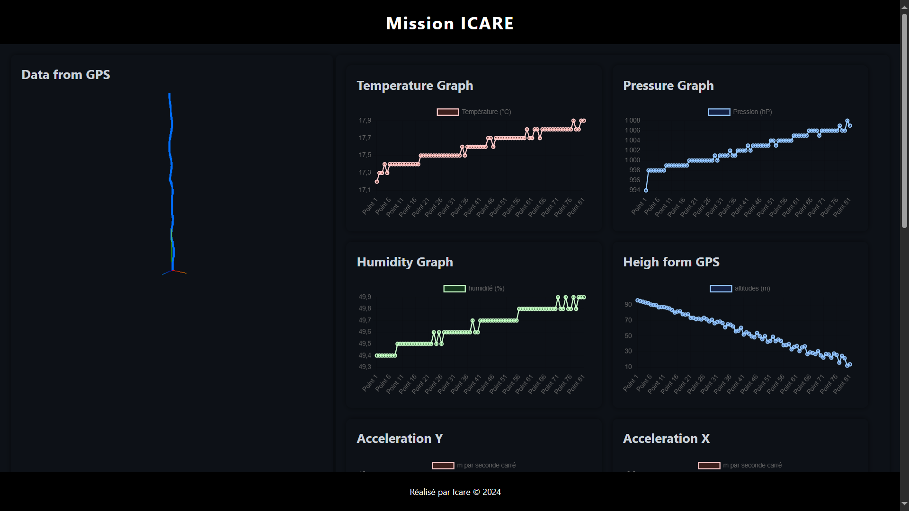

<h1>DatIcare</h1>

This is a webUI made by myself in order to parse and visualize data received from a capsule for the ICARE project. It can be easily adapted to prety much any things. Feel free to adapt and use it as you wish. 

Data are read from a file <i> data.txt </i> and need to be written as follows : 
 <pre>
 Lon: ____ 
 Lat: ___ 
 Alt: ___ 
 P: ___ 
 T: ___ 
 hum: ___ 
 X: ___ 
 Y: ___ 
 Z: ___
</pre>
The values that are read are floating point values using '.' to separate whole value from decimal. ex : "19.85".

For any commercial use please contact me.
